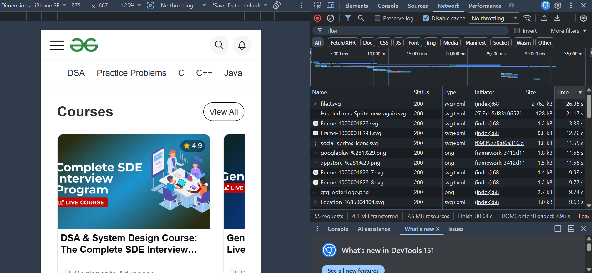

# Network Analysis

## Website
GeeksforGeeks

## Results
- Total requests: 55
- Data transferred: 4.1 MB
- Total resources: 7.6 MB
- Slowest resource: `file3.svg`
- Time: 26.35 seconds
- Status: 200

## 3xx / 4xx Responses
No 3xx or 4xx responses were found.

## Observation 
The page made 55 requests and loaded around 7.6 MB of resources. 
The slowest resource was `file3.svg`, which took 26.35 seconds.

## Screenshot

